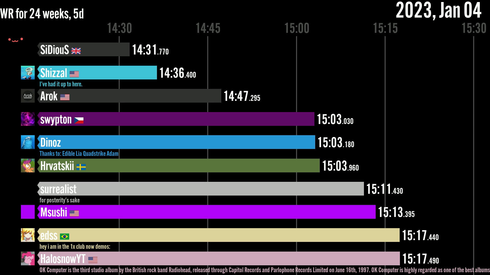

# animated-bar-chart
This repository contains utilities for creating animated bar chart world record history videos from speedrun.com, Twitch, and YouTube data.

## Setup
To get started, you will need to install the following dependencies:
* Python (3.10+)
* FFmpeg (for rendering the video file)

You will also need the following PyPI packages:
* srcomapi
* requests
* aiohttp
* inquirer
* PIL (Python Imaging Library)
* pygame
* python-dotenv

## Usage
1. Clone this github repository and open a terminal.
2. Fill out the .env file with your Twitch and YouTube API keys (these will be used for obtaining profile pictures URLs).
3. Add two fonts (one being monospaced), and add their paths to the .env file (optional).
4. Run `python3.10 ./src/main.py get_game_info`, and answer the questions.
5. Run `python3.10 ./src/main.py fetch_data`.
6. Run `python3.10 ./src/main.py chart_data`.

## Customization
There are many customization options for the animated bar chart. To start customizing, open ./src/scripts/chart_data.py. Then, you can set record to False while you experiment.

## Credits
The layout for the animated bar chart is heavily inspired by [Abacaba's Celeste speedrun history video](https://youtu.be/T_0ACLhtgnU). Additionally, the idea of using the cosine function for interpolation is also from [Abacaba's tutorial series](https://youtu.be/7srfHUXP6kM).

If you upload a video made using this project, please leave a link to this repository in the description.
